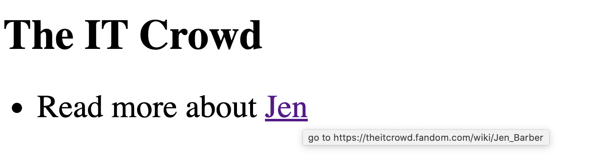

# Assignment: A dummy link

*PLEASE READ THIS **ENTIRE** DOCUMENT FIRST*

* [the assignment](#the-assignment)
* [submitting-your-work](#submitting-your-work)

## The assignment

Download this repo and edit the `script.js`.

* The page is deliberately long. If you click the hyperlink, the page will scroll (jump) to the bottom until the element with `id="jen"` is in view. That's the default behaviour of hyperlinks which use anchor links; links like `<a href="#jump-to-another-section-in-this-page">click</a>`.
* Make sure the text of the list item on top changes to: "Read more about", along with a hyperlink that links to [https://theitcrowd.fandom.com/wiki/Jen_Barber](https://theitcrowd.fandom.com/wiki/Jen_Barber).
* Only edit the javascript file!
* StackOverflow.com is a pretty popular site where you probably always find an answer to your question. Use the answer on [this page](https://stackoverflow.com/questions/35136905/how-to-change-the-content-of-an-element-with-childnodes-javascript) to find out how to change the text node from the `<li>` to "Read more about".
* You'll have to use `setAttribute` to change the href of the hyperlink that's inside the `<li>`.  
* You can add a small info text when hovering over elements using the `title=""` HTML attribute. Add this attribute to the hyperlink as well and put this text inside: `"go to https://theitcrowd.fandom.com/wiki/Jen_Barber"`.

Make sure this project works locally.

## Submitting your work
* Create a new branch called **gh-pages** and upload your local work into this branch.
* Start a new **pull request**, select one **reviewer** and make sure to put the **GitHub Pages URL** in the comment section. 
* Do **not** merge this Pull Request yourself. That's up to the reviewer to decide (merging is approving the assignment).
